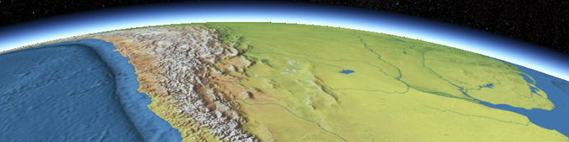

Imagery
=======

Imagery from public datasets tiled for use for Cesium.  Also see the [Cesium Imagery Layers Tutorial](http://cesium.agi.com/2013/01/04/Cesium-Imagery-Layers-Tutorial/).

Please credit the orginial dataset when required.

NaturalEarthII
--------------



[1:10m Natural Earth II](http://www.naturalearthdata.com/downloads/10m-raster-data/10m-natural-earth-2/) in a Tile Map Service (TMS) layout.  This is reasonable imagery for space applications like the [Cygnus simulation](http://cesium.agi.com/cygnus/) developed by [AGI](http://www.agi.com/).  Some pixelation is noticeable when viewing from satellites in low Earth orbit.

This has levels 0-5; the Natural Earth II imagery included with Cesium ([Source/Assets/Textures/NaturalEarthII](https://github.com/AnalyticalGraphicsInc/cesium/tree/master/Source/Assets/Textures/NaturalEarthII)) only has level 0-2.

[Terms of Use](http://www.naturalearthdata.com/about/terms-of-use/) (public domain)

**Code Example**

```javascript
var widget = new Cesium.CesiumWidget('cesiumContainer', {
  imageryProvider : new TileMapServiceImageryProvider({
    url : buildModuleUrl('assets/imagery/NaturalEarthII/'),
    maximumLevel : 5,
    credit : 'Imagery courtesy Natural Earth'
  }),
});

```

<!--

```javascript
var widget = new Cesium.CesiumWidget('cesiumContainer', {
  imageryProvider : new Cesium.TileMapServiceImageryProvider({
    url : 'http://cesium.agi.com/blackmarble',
    maximumLevel : 8,
    credit : 'Black Marble imagery courtesy NASA Earth Observatory'
  })
});
```

-->
